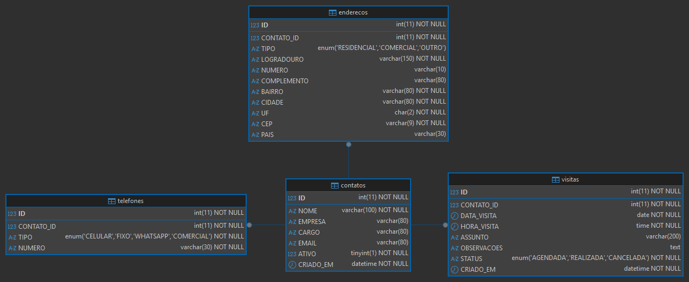

# Carteira de Contatos

Sistema de gerenciamento de contatos desenvolvido em PHP utilizando os princípios de Programação Orientada a Objetos (POO).

## Tecnologias

- PHP
- MariaDB
- XAMPP (Apache)
- HeidiSQL

## Funcionalidades

- Cadastro de contatos com nome, empresa, cargo e e-mail
- Cadastro de telefones vinculados ao contato
- Cadastro de endereços vinculados ao contato
- Agendamento de visitas vinculadas ao contato
- Listagem e edição de todos os registros

## Diagrama ER



## Estrutura do Projeto

```
carteira/
├── banco_dados.sql
├── index.php
├── coon/
│   └── banco.php
└── src/
    └── models/
        ├── classe.php
        ├── contato.php
        ├── telefone.php
        ├── endereco.php
        └── visita.php
```

## Como Executar

1. Clone o repositório
2. Importe o `banco_dados.sql` no HeidiSQL ou DBeaver
3. Configure usuário e senha em `coon/banco.php`
4. Copie a pasta para `C:/xampp/htdocs/carteira`
5. Inicie o Apache no XAMPP Control Panel
6. Acesse `http://localhost/carteira/index.php`
